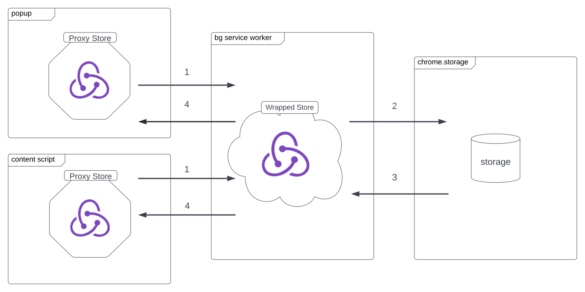

# Overview

For state management we use `webext-redux` to facilitate passing state between the `background` service worker and `popup`. We use an alternative version of the library which supports `manifest v3`. See on a [github](https://github.com/eduardoacskimlinks/webext-redux).

###  Webext-redux Dataflow

|  |
|:--:| 
| *webext-redux dataflow diagram* |

## Location

All initial redux boilerplate and slices stored in `src/state`. We use `slices` to combine reducers and organize Redux logic.

## Adding a new slice

Adding a new slice is fairly simple. Navigate to a plugin in `src/state/slices`. Simply add a new file with the same name as future slice. Using of `createSlice` enables writing immutable updates using "mutating" JS syntax like `state.value = 123`, with no spreads needed. It also automatically generates action creator functions for each reducer, and generates action type strings internally based on your reducer's names.

```js
interface ExampleState {
  counter: number
}

const defaultState: ExampleState = {
  counter: 42,
}

export const create: Create<ExampleState> = initialState =>
  createSlice({
    name: 'example',
    initialState: initialState || defaultState,
    reducers: {
      increment(state) {
        state.counter += 1
      },
      decrement(state) {
        state.counter -= 1
      },
      set(state, action: PayloadAction<number>) {
        state.counter = action.payload
      },
    },
  })

const exampleSlice = create()
export const { increment, decrement, set } = exampleSlice.actions
export default exampleSlice.reducer
```

Then go to `src/state/store` and add the new created slice to reducers list:

```js
const exampleReducer = createExample(initialState?.example).reducer
const viewReducer = createView(initialState?.view).reducer

const reducer = {
  example: exampleReducer,
  view: viewReducer,
}

```
For now we are creating all slices by using `create` function for each slice, but we plan to get rid of this when we collect enough of them.

## Considerations when passing state between background and popup

### Data compatibility

As was mentioned in the start of this page, the extension uses `webext-redux` to enable state to be passed between the `popup` and `background` pages. Under the hood, `webext-redux` used the [WebExtension messaging interface](https://developer.mozilla.org/en-US/docs/Mozilla/Add-ons/WebExtensions/API/runtime/onMessage) This is not without its caveats. For example the messaging system cannot support `Functions` they will be transformed into strings. It's recommended to only send data that adheres [to the structured clone algorithm](https://developer.mozilla.org/en-US/docs/Web/API/Web_Workers_API/Structured_clone_algorithm) to limit the amount of issues that may be caused.

### Background service worker

> Note! In Manifest V3, background pages are now [service workers](https://developer.mozilla.org/en-US/docs/Web/API/Service_Worker_API). A background service worker is loaded when it is needed, and unloaded when it goes idle.

For example:
+ The extension is first installed or updated to a new version.
+ The background page was listening for an event, and the event is dispatched.
+ A content script or other extension sends a message.
+ Another view in the extension, such as a popup, calls `runtime.getBackgroundPage`.

Once it has been loaded, an extension's service worker generally keeps running as long as it is performing an action, such as calling a Chrome API or issuing a network request.

> Opening a view doesn't cause the service worker to load, but only prevents it from closing once loaded.

Effective background scripts stay dormant until an event they are listening for fires, react with specified instructions, then unload.

[More details on developer.chrome.com](https://developer.chrome.com/docs/extensions/mv3/service_workers/)

### Keeping the popup in sync with the background

Due to the nature of how state works in the extension. You **cannot** import the redux store into your component and dispatch.

If you do use the redux store directly from the popup then it will bypass the messaging system `webext-redux` uses to keep track of what state has changed.


You should provide context `<Provider store={proxyStore}>` into a root React component  and than use `useDispatch` and `useSelector` hooks form `src/state/hooks.ts`.

```jsx
import { useSelector, useDispatch } from 'state/hooks'
import { increment } from 'state/slices/example'

const Example = () => {
  const dispatch = useDispatch()
  const counter = useSelector(state => state?.example?.counter)

  const handleClick = async () => {
    await dispatch(increment())
  }

  return (
    <div className="App">
      <header className="App-header">
        <p>
          Counter value is <code>{counter}</code>
        </p>
        <button className="button" onClick={handleClick}>
          Test Redux
        </button>
      </header>
    </div>
  )
}

```


> Set your eyes on `await dispatch(increment())`
Contrary to regular Redux, all dispatches are asynchronous and return a Promise. It is inevitable since proxy stores and the main store communicate via browser messaging, which is inherently asynchronous.

### Routing

To navigate between views in the Popup you can use hooks `useGoTo` and `useGoBack` from `src/services/navigation`

```jsx
import { useGoTo, useGoBack } from 'services/navigation'

const SplashPage: ThemeUiElement = () => {
  const { theme } = useThemeUI()
  const goToSignup = useGoTo('Signup')

  return (
    <>
      ...
      <Button onClick={goToSignup}>
      <Button onClick={useGoBack()}>
    </>
  )
} 
```